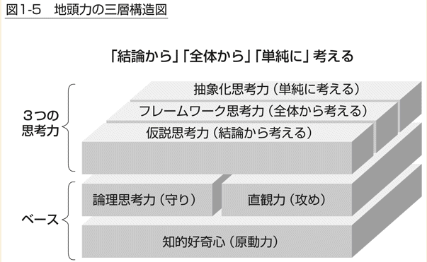

## 地頭力の構成要素

- 思考力
  - 抽象化思考(単純に考える)
  - フレームワーク思考(全体から考える)
  - 仮説思考(結論から考える)

## フェルミで使用する上記に即した力

- 仮説思考(結論から考える)
  - 少ない情報からでももっとも可能性の高い結論(仮説)を構築する
  - 常に仮説をゴールとして意識
  - 情報の精度をあげながら検証を繰り返して結論に至る

- フレームワーク思考(全体から考える)
  - 対象の全体像を俯瞰する
  - 全体像を最適な切り口で切り、断面を分析する
    - 分類
    - 因数分解

- 抽象化思考(単純に考える)
  - 対象の最大の特徴を抽出して「単純化」「モデル化」
  - 抽象レベルで一般解を出す
  - 具体化して個別解を出す

## 仮説思考をつけるために

- 少ない情報からでももっとも可能性の高い結論(仮説)を構築する => 少ない情報からでも仮説を構築する姿勢
- 常に仮説をゴールとして意識 => 前提条件を設定して先に進む姿勢
- 情報の精度をあげながら検証を繰り返して結論に至る => 時間を決めてとにかく結論を出す姿勢

43%